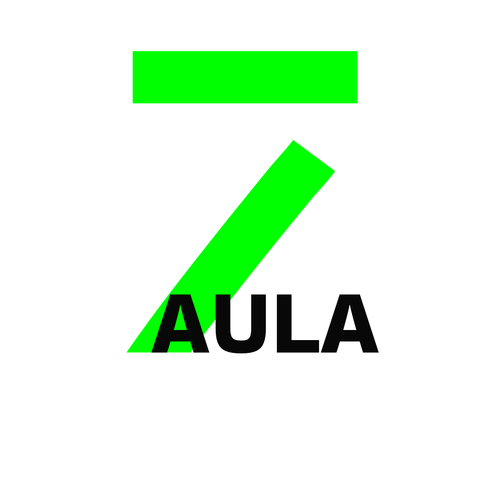

##   ¡Hi! Nice to meet you 💛
This is my favorite space and you are Welcome here 💻

## Languages

Procuro seguir actualizando mis conocimientos para poder dedicarme al:

### Data Base - Machine Learning - Full-stack

## My tools

	

## Data Base

## Animation and Design

## System

 

## Social Media

En mis redes sociales tambien puedes encontrarme y escribirme al DM que con gusto te respondere, tambien puedes contactarme a mi email...

## Remote Work

## CHANNELS IN YOUTUBE
###  Your Medic
###  Kamart en facetas
###  Aula 7

